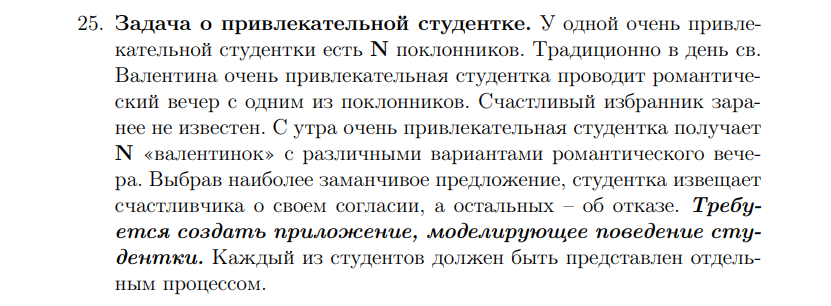

# Нарин Алексей Сергеевич, БПИ217<br>
## ОС ИДЗ_2
### Вариант 25


Использование: <br>
```gcc main.c -w -o res ; ./res N```<br>
Где N — число поклонников, от 1 до 10000 включительно.

Процессы внутри программы взаимодействуют с использованием семафоров по стандарту UNIX SYSTEM V. <br><br>
Набор семафоров используется процессом-студенткой и процессами-поклонниками в количестве N, заданном как аргумент командной строки.<br><br>
Студентка читает по порядку полученные предложения и выбирает наиболее привлекательное (привлекательность предложений случайна). Она может начать анализ до того как придут все, но на каждом шагу убеждается что текущий поклонник уже прислал предложение.

Выбранное предложение и его автор выводятся, затем приложение завершает работу.